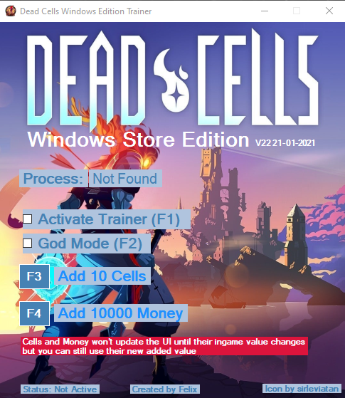
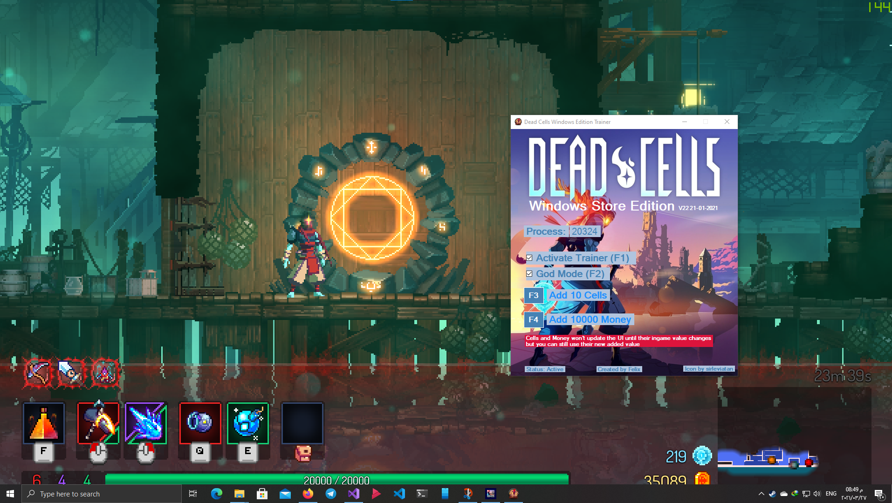

# DeadCells-WS-Trainer
Dead Cells basic Trainer for Microsoft Store Edition.

## Requirments
1. .net framework 4.8 need to be installed, [download](https://dotnet.microsoft.com/download/dotnet-framework/net48)
2. run the trainer after starting your game session

## Features
1. God Mode (your total health and current health will be 20000)
2. Add Cells (10 at a time)
3. Add Money (10000 at a time)

## Warning
The Add Cells/Money cheat will only update the UI value for the user to the real one when you earn some from killing enemies but you still will be able to use them in shops no problem without being updated.

## Screenshots

